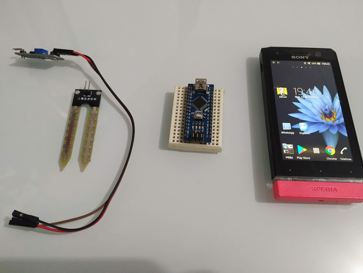
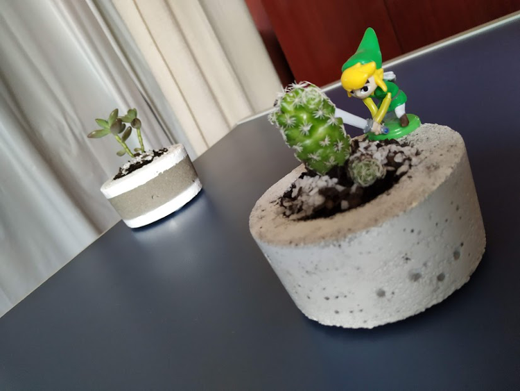
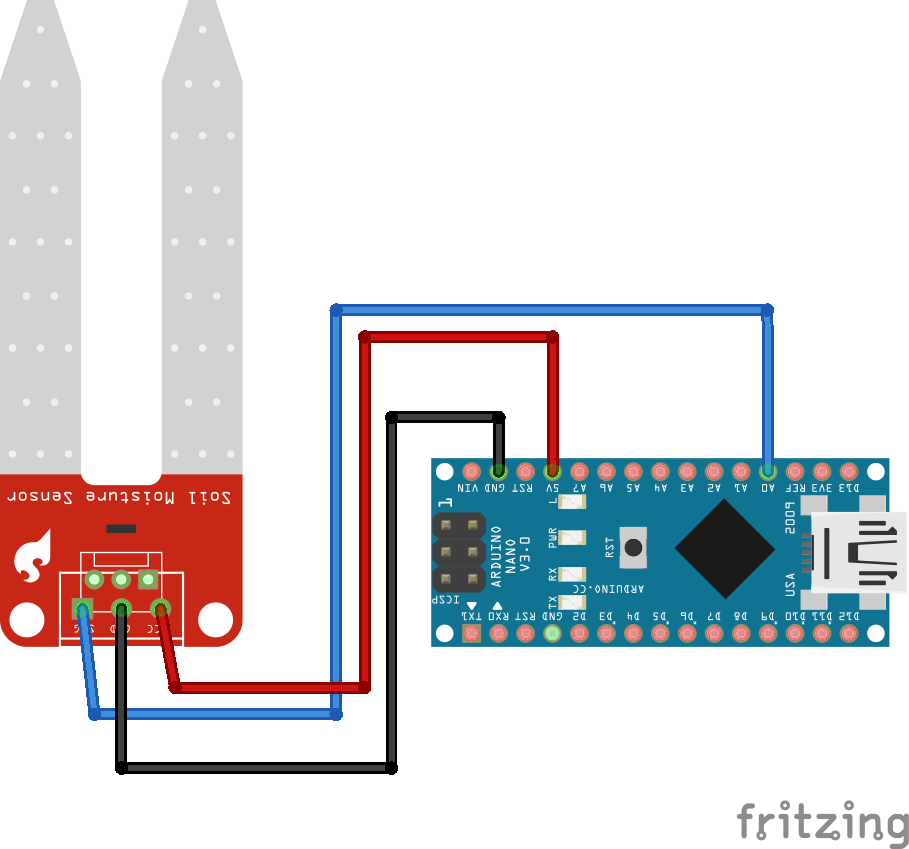

Android Monitor Moisture Soil
=======

A project for arduino communicate with android device using OTG

Description
------------
This project is a sample for testing the communication of arduino with a android device using OTG.

For this case, I am using a moisture sensor, where I will perform soil readings.

Materials
------------
Hardware used for this project.

Vessel of plant where we will perform the measurement of soil moisture.

Scheme Arduino + Sensor
---------------------------

States
------------
- **SAD**

Informs that the soil needs to be watered because it is very dry.

- **NORMAL**

Informs that the soil is at normal humidity.

- **HAPPY**

Informs that the soil is moist enough for the plant.

Demonstration
----------------

License
--------

    Copyright 2019 Vilmar Bispo Filho

    Licensed under the Apache License, Version 2.0 (the "License");
    you may not use this file except in compliance with the License.
    You may obtain a copy of the License at

       http://www.apache.org/licenses/LICENSE-2.0

    Unless required by applicable law or agreed to in writing, software
    distributed under the License is distributed on an "AS IS" BASIS,
    WITHOUT WARRANTIES OR CONDITIONS OF ANY KIND, either express or implied.
    See the License for the specific language governing permissions and
    limitations under the License.